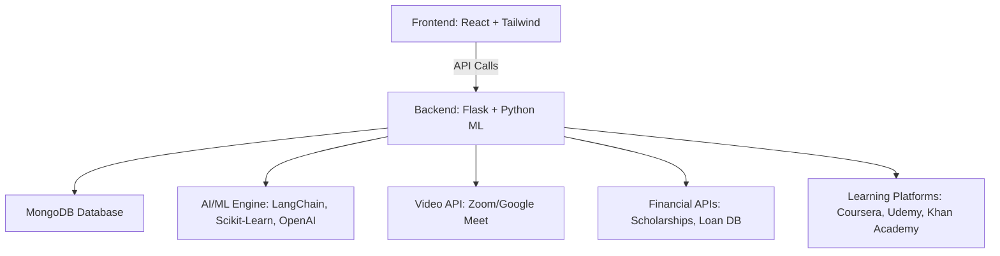
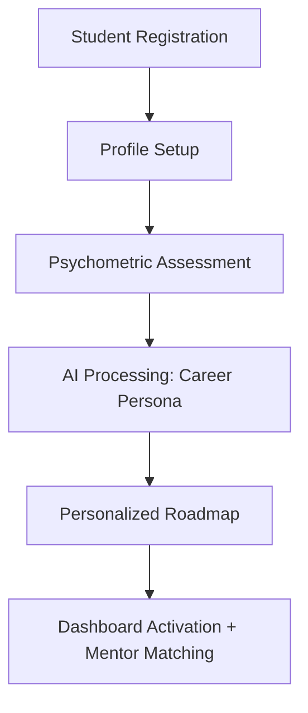

# 🚀 AI-Powered Career Guidance & Mentorship Platform

[](https://flask.palletsprojects.com/)
[](https://react.dev/)
[](https://www.mongodb.com/)
[](LICENSE)

> 🌟 A modern **EdTech + HRTech platform** that helps students, parents, and mentors with **AI-powered career guidance, psychometric assessments, financial planning, and mentorship**.

---

## 📌 Features

* 🔑 **User Management** (Role-based: Student, Parent, Mentor, Admin)
* 🧠 **AI Assessment Engine** (Psychometric tests, Skills evaluation, Career persona generation)
* 🗺️ **Career Roadmaps** (Personalized pathways with course integrations)
* 💰 **Financial Planning** (Cost & ROI analysis, Scholarships, Aid recommendations)
* 🎥 **Mentorship** (Video sessions, scheduling, progress monitoring)
* 📊 **Analytics Dashboard** (Student progress, Parent insights, Recommendations)

---

## 🏗️ System Architecture



---

## 📈 Student Onboarding Flow



---

## 🛠️ Tech Stack

**Frontend:** React 19, TypeScript, TailwindCSS, Recharts, Framer Motion  
**Backend:** Flask (Python 3.11+), Flask-RESTful, Celery, Redis  
**Database:** MongoDB 8.0 (Atlas), Redis for caching  
**AI/ML:** LangChain, Scikit-learn, Transformers, OpenAI API  
**Infrastructure:** AWS (EC2, RDS, S3, CloudFront), Docker, Kubernetes, Terraform

---

## 📊 Example Analytics (Recharts)

```jsx
import { LineChart, Line, XAxis, YAxis, Tooltip, CartesianGrid } from "recharts";

const data = [
  { month: "Jan", users: 200 },
  { month: "Feb", users: 500 },
  { month: "Mar", users: 900 },
  { month: "Apr", users: 1500 },
];

export default function UserGrowthChart() {
  return (
    <LineChart width={500} height={300} data={data}>
      <XAxis dataKey="month" />
      <YAxis />
      <Tooltip />
      <CartesianGrid stroke="#ccc" />
      <Line type="monotone" dataKey="users" stroke="#4f46e5" strokeWidth={3} />
    </LineChart>
  );
}
```

---

## 🚀 Getting Started

```bash
# Clone the repository
git clone https://github.com/your-org/career-platform.git
cd career-platform

# Setup backend
cd backend
pip install -r requirements.txt
flask run

# Setup frontend
cd frontend
npm install
npm run dev
```

---

## ✅ Roadmap

* [x] User authentication & role management
* [x] AI psychometric testing engine
* [ ] Mobile app (React Native)
* [ ] Advanced AI resume builder
* [ ] Global mentor marketplace

---

## 🤝 Contributing

Contributions are welcome! Please open issues and submit PRs for new features.

---

## 📜 License

MIT © 2025 Blitzy System 2 AI

---

👉 Do you want me to also **add dummy screenshots & badges for analytics** (like GitHub stars, coverage %, CI/CD passing badge), so the README looks even more professional?
