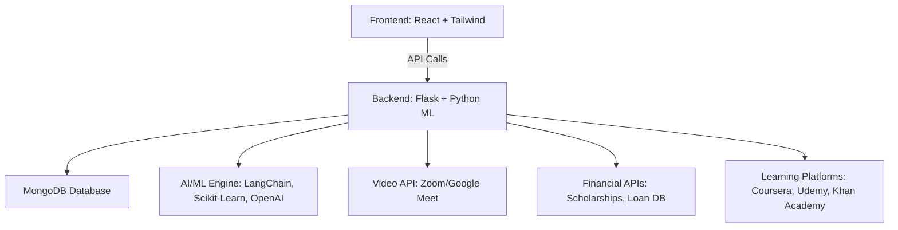
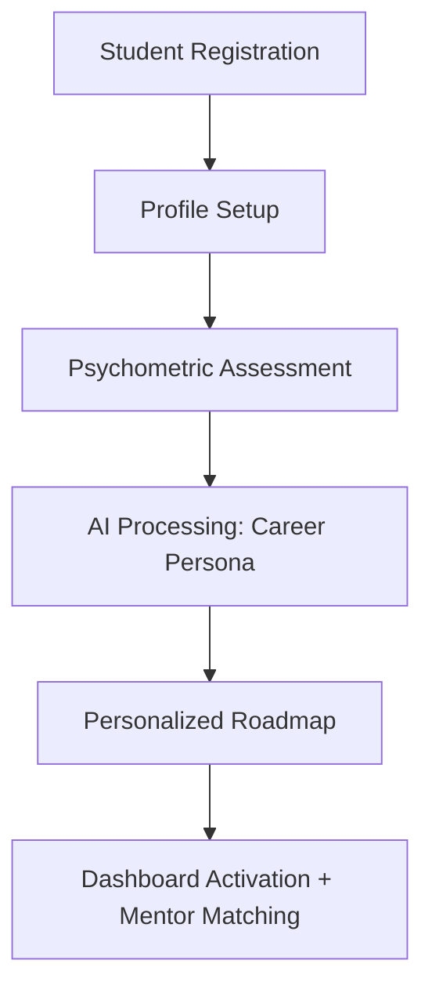

# 🚀 AI-Powered Career Guidance & Mentorship Platform

[](https://flask.palletsprojects.com/)
[](https://react.dev/)
[](https://www.mongodb.com/)
[](#-license)

> 🌟 A modern **EdTech + HRTech platform** that helps students, parents, and mentors with **AI-powered career guidance, psychometric assessments, financial planning, and mentorship**.

## 📋 Table of Contents

- [Features](#-features)
- [System Architecture](#️-system-architecture)
- [Student Onboarding Flow](#-student-onboarding-flow)
- [Tech Stack](#️-tech-stack)
- [Project Structure](#-project-structure)
- [Example Analytics](#-example-analytics-recharts)
- [Getting Started](#-getting-started)
- [Roadmap](#-roadmap)
- [Contributing](#-contributing)
- [License](#-license)

---

## 📌 Features

* 🔑 **User Management** (Role-based: Student, Parent, Mentor, Admin)
* 🧠 **AI Assessment Engine** (Psychometric tests, Skills evaluation, Career persona generation)
* 🗺️ **Career Roadmaps** (Personalized pathways with course integrations)
* 💰 **Financial Planning** (Cost & ROI analysis, Scholarships, Aid recommendations)
* 🎥 **Mentorship** (Video sessions, scheduling, progress monitoring)
* 📊 **Analytics Dashboard** (Student progress, Parent insights, Recommendations)

---

## 🏗️ System Architecture


```mermaid
graph TD
  A[Frontend: React + Tailwind] -->|API Calls| B[Backend: Flask + Python ML]
  B --> C[MongoDB Database]
  B --> D[AI/ML Engine: LangChain, Scikit-Learn, OpenAI]
  B --> E[Video API: Zoom/Google Meet]
  B --> F[Financial APIs: Scholarships, Loan DB]
  B --> G[Learning Platforms: Coursera, Udemy, Khan Academy]
```

---

## 📈 Student Onboarding Flow


```mermaid
flowchart TD
  A[Student Registration] --> B[Profile Setup]
  B --> C[Psychometric Assessment]
  C --> D[AI Processing: Career Persona]
  D --> E[Personalized Roadmap]
  E --> F[Dashboard Activation + Mentor Matching]
```

---

## 🛠️ Tech Stack

**Frontend:** React 19, TypeScript, TailwindCSS, Recharts, Framer Motion  
**Backend:** Flask (Python 3.11+), Flask-RESTful, Celery, Redis  
**Database:** MongoDB 8.0 (Atlas), Redis for caching  
**AI/ML:** LangChain, Scikit-learn, Transformers, OpenAI API  
**Infrastructure:** AWS (EC2, RDS, S3, CloudFront), Docker, Kubernetes, Terraform

---

## 📁 Project Structure

```
Career-project/
├── backend/          # Flask API server
├── frontend/         # React application
├── database/         # Database schemas and migrations
└── README.md         # This file
```

---

## 📊 Example Analytics (Recharts)

```jsx
import { LineChart, Line, XAxis, YAxis, Tooltip, CartesianGrid } from "recharts";

const data = [
  { month: "Jan", users: 200 },
  { month: "Feb", users: 500 },
  { month: "Mar", users: 900 },
  { month: "Apr", users: 1500 },
];

export default function UserGrowthChart() {
  return (
    <LineChart width={500} height={300} data={data}>
      <XAxis dataKey="month" />
      <YAxis />
      <Tooltip />
      <CartesianGrid stroke="#ccc" />
      <Line type="monotone" dataKey="users" stroke="#4f46e5" strokeWidth={3} />
    </LineChart>
  );
}
```

---

## 🚀 Getting Started

### Prerequisites
- Python 3.11+
- Node.js 18+
- MongoDB (local or Atlas)

### Installation

```bash
# Clone the repository
git clone https://github.com/rajumanoj333/Career-project.git
cd Career-project

# Setup backend
cd backend
pip install -r requirements.txt
flask run

# Setup frontend (in a new terminal)
cd frontend
npm install
npm run dev
```

For detailed setup instructions, see:
- [Backend Setup](./backend/README.md)
- [Frontend Setup](./frontend/README.md)

---

## ✅ Roadmap

* [x] User authentication & role management
* [x] AI psychometric testing engine
* [ ] Mobile app (React Native)
* [ ] Advanced AI resume builder
* [ ] Global mentor marketplace

---

## 🤝 Contributing

We welcome contributions from the community! Here's how you can help:

1. **Fork** the repository
2. **Create** a feature branch (`git checkout -b feature/amazing-feature`)
3. **Commit** your changes (`git commit -m 'Add some amazing feature'`)
4. **Push** to the branch (`git push origin feature/amazing-feature`)
5. **Open** a Pull Request

Feel free to check the [roadmap](#-roadmap) above for ideas on what to work on next!

---

## 📜 License

MIT © 2025

---

